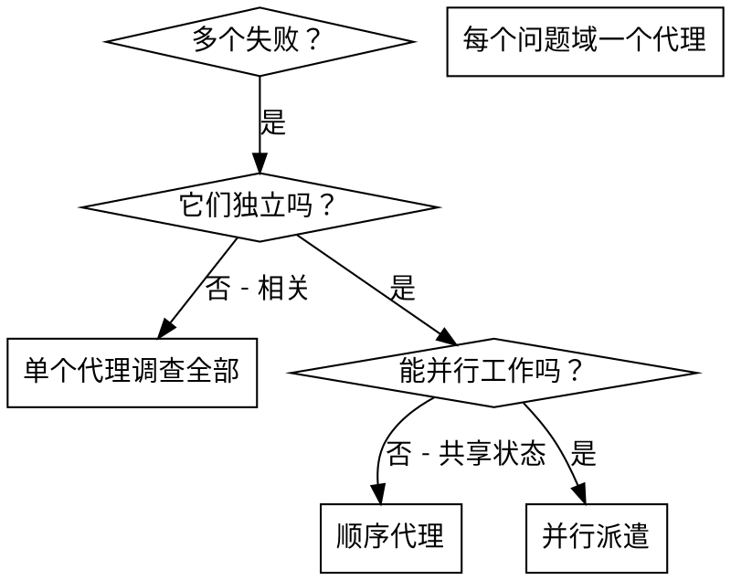

# 派遣并行代理

## 概述

当你有多个不相关的失败（不同测试文件、不同子系统、不同 bug），顺序调查会浪费时间。每个调查都是独立的，可以并行进行。

**核心原则：** 每个独立问题域派遣一个代理。让它们并发工作。

## 何时使用



**使用当：**
- 3+ 个测试文件因不同根本原因失败
- 多个子系统独立损坏
- 每个问题可以不需要其他上下文就能理解
- 调查之间没有共享状态

**不用当：**
- 失败相关（修一个可能修好其他）
- 需要理解完整系统状态
- 代理会互相干扰

## 模式

### 1. 识别独立领域

按坏的东西分组失败：
- 文件 A 测试：工具审批流程
- 文件 B 测试：批次完成行为
- 文件 C 测试：中止功能

每个领域都独立 - 修工具审批不会影响中止测试。

### 2. 创建聚焦的代理任务

每个代理得到：
- **具体范围：** 一个测试文件或子系统
- **清晰目标：** 让这些测试通过
- **约束：** 别改其他代码
- **预期输出：** 你发现和修复了什么的摘要

### 3. 并行派遣

```typescript
// 在 Claude Code / AI 环境中
Task("修复 agent-tool-abort.test.ts 失败")
Task("修复 batch-completion-behavior.test.ts 失败")
Task("修复 tool-approval-race-conditions.test.ts 失败")
// 三个同时运行
```

### 4. 审查并整合

代理返回时：
- 读每个摘要
- 验证修复不冲突
- 运行完整测试套件
- 整合所有改动

## 代理提示结构

好的代理提示是：
1. **聚焦** - 一个清晰的问题域
2. **自包含** - 理解问题需要的所有上下文
3. **输出具体** - 代理应该返回什么？

```markdown
修复 src/agents/agent-tool-abort.test.ts 中的 3 个失败测试：

1. "should abort tool with partial output capture" - 期望消息中有 'interrupted at'
2. "should handle mixed completed and aborted tools" - 快速工具被中止而不是完成
3. "should properly track pendingToolCount" - 期望 3 个结果但得到 0

这些是时序/竞态条件问题。你的任务：

1. 读测试文件并理解每个测试验证什么
2. 识别根本原因 - 时序问题还是真正的 bug？
3. 修复方法：
   - 用基于事件的等待替换任意超时
   - 如果发现中止实现中的 bug 就修复
   - 如果测试改变的行为就调整测试期望

别只是增加超时 - 找到真正的问题。

返回：你发现了什么和修复了什么的摘要。
```

## 常见错误

**❌ 太宽泛：** "修所有测试" - 代理迷失了
**✅ 具体：** "修 agent-tool-abort.test.ts" - 聚焦范围

**❌ 没上下文：** "修竞态条件" - 代理不知道在哪
**✅ 上下文：** 粘贴错误信息和测试名

**❌ 没约束：** 代理可能重构一切
**✅ 约束：** "别改生产代码" 或 "只修测试"

**❌ 模糊输出：** "修好" - 你不知道改了什么
**✅ 具体：** "返回根本原因和改动摘要"

## 何时不用

**相关失败：** 修一个可能修好其他 - 先一起调查
**需要完整上下文：** 理解需要看整个系统
**探索性调试：** 你还不知道坏了什么
**共享状态：** 代理会互相干扰（编辑同一文件、使用同一资源）

## 会话真实示例

**场景：** 大重构后 3 个文件中有 6 个测试失败

**失败：**
- agent-tool-abort.test.ts：3 个失败（时序问题）
- batch-completion-behavior.test.ts：2 个失败（工具没执行）
- tool-approval-race-conditions.test.ts：1 个失败（执行计数 = 0）

**决策：** 独立领域 - 中止逻辑独立于批次完成独立于竞态条件

**派遣：**
```
代理 1 → 修 agent-tool-abort.test.ts
代理 2 → 修 batch-completion-behavior.test.ts
代理 3 → 修 tool-approval-race-conditions.test.ts
```

**结果：**
- 代理 1：用基于事件的等待替换超时
- 代理 2：修复事件结构 bug（threadId 位置错误）
- 代理 3：添加等待异步工具执行完成

**整合：** 所有修复独立，无冲突，完整套件全绿

**节省时间：** 3 个问题并行解决 vs 顺序解决

## 关键收益

1. **并行化** - 多个调查同时进行
2. **聚焦** - 每个代理范围窄，跟踪的上下文少
3. **独立性** - 代理不互相干扰
4. **速度** - 3 个问题在 1 个的时间内解决

## 验证

代理返回后：
1. **审查每个摘要** - 理解改了什么
2. **检查冲突** - 代理编辑了同一代码吗？
3. **运行完整套件** - 验证所有修复一起工作
4. **抽查** - 代理可能犯系统性错误

## 真实世界影响

来自调试会话（2025-10-03）：
- 3 个文件中 6 个失败
- 3 个代理并行派遣
- 所有调查并发完成
- 所有修复成功整合
- 代理改动间零冲突
