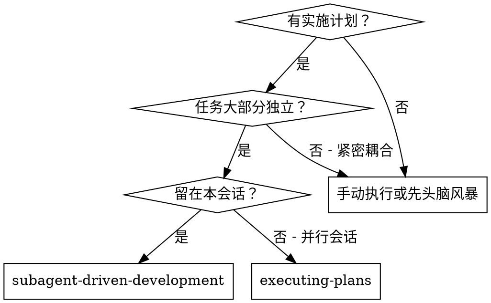
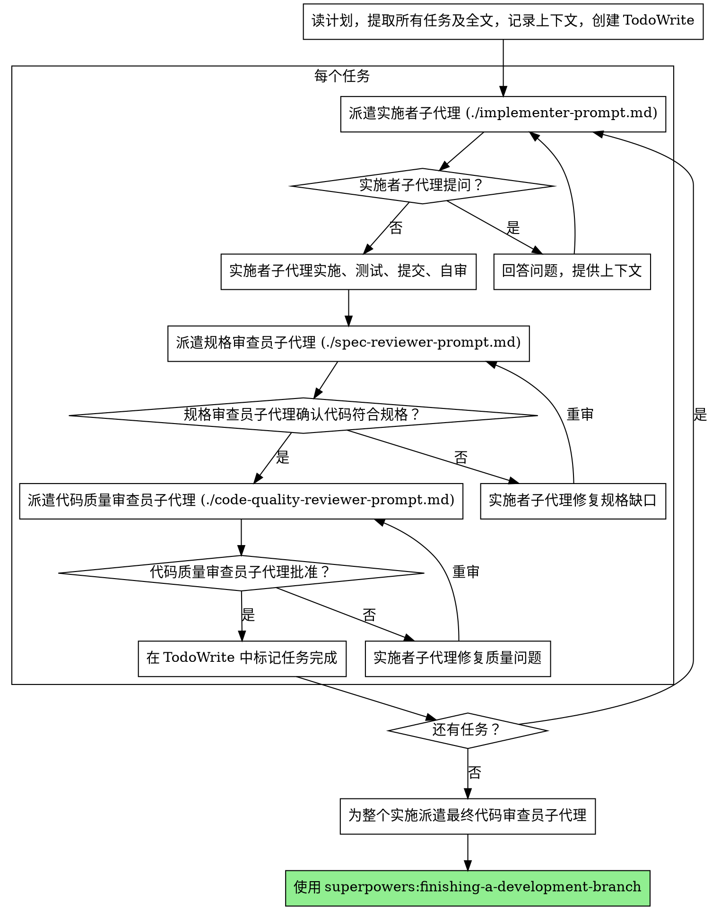

# 子代理驱动开发

通过为每个任务派遣新的子代理来执行计划，每个任务后进行两阶段审查：先规格合规审查，然后代码质量审查。

**核心原则：** 每任务新子代理 + 两阶段审查（规格然后质量）= 高质量、快速迭代

## 何时使用



**vs. 执行计划（并行会话）：**
- 同会话（无上下文切换）
- 每任务新子代理（无上下文污染）
- 每任务后两阶段审查：先规格合规，然后代码质量
- 更快迭代（任务间无人工参与）

## 流程



## 提示模板

- `./implementer-prompt.md` - 派遣实施者子代理
- `./spec-reviewer-prompt.md` - 派遣规格合规审查员子代理
- `./code-quality-reviewer-prompt.md` - 派遣代码质量审查员子代理

## 示例工作流

```
你：我正在使用子代理驱动开发来执行这个计划。

[读一次计划文件：docs/plans/feature-plan.md]
[提取所有 5 个任务及全文和上下文]
[用所有任务创建 TodoWrite]

任务 1：Hook 安装脚本

[获取任务 1 文本和上下文（已提取）]
[用完整任务文本 + 上下文派遣实施子代理]

实施者："开始前 - hook 应该安装在用户级还是系统级？"

你："用户级（~/.config/superpowers/hooks/）"

实施者："明白了。现在实施..."
[稍后] 实施者：
  - 实施了 install-hook 命令
  - 添加了测试，5/5 通过
  - 自审：发现我漏了 --force 标志，已添加
  - 已提交

[派遣规格合规审查员]
规格审查员：✅ 符合规格 - 所有需求满足，没有额外内容

[获取 git SHA，派遣代码质量审查员]
代码审查员：优点：测试覆盖好，干净。问题：无。批准。

[标记任务 1 完成]

任务 2：恢复模式

[获取任务 2 文本和上下文（已提取）]
[用完整任务文本 + 上下文派遣实施子代理]

实施者：[无问题，继续]
实施者：
  - 添加了验证/修复模式
  - 8/8 测试通过
  - 自审：全部好
  - 已提交

[派遣规格合规审查员]
规格审查员：❌ 问题：
  - 缺失：进度报告（规格说"每 100 项报告一次"）
  - 额外：添加了 --json 标志（未请求）

[实施者修复问题]
实施者：移除了 --json 标志，添加了进度报告

[规格审查员再次审查]
规格审查员：✅ 现在符合规格

[派遣代码质量审查员]
代码审查员：优点：扎实。问题（重要）：魔术数字（100）

[实施者修复]
实施者：提取了 PROGRESS_INTERVAL 常量

[代码审查员再次审查]
代码审查员：✅ 批准

[标记任务 2 完成]

...

[所有任务后]
[派遣最终代码审查员]
最终审查员：所有需求满足，准备合并

完成！
```

## 优势

**vs. 手动执行：**
- 子代理自然遵循 TDD
- 每任务新上下文（不混淆）
- 并行安全（子代理不干扰）
- 子代理可以提问（工作前和期间）

**vs. 执行计划：**
- 同会话（无交接）
- 持续进展（无等待）
- 审查检查点自动

**效率提升：**
- 无文件读取开销（控制器提供全文）
- 控制器精确整理需要的上下文
- 子代理预先获得完整信息
- 问题在工作开始前浮现（不是之后）

**质量关卡：**
- 自审在交接前抓住问题
- 两阶段审查：规格合规，然后代码质量
- 审查循环确保修复真正有效
- 规格合规防止过度/不足构建
- 代码质量确保实施构建良好

**成本：**
- 更多子代理调用（每任务实施者 + 2 个审查员）
- 控制器做更多准备工作（预先提取所有任务）
- 审查循环添加迭代
- 但早期抓住问题（比之后调试便宜）

## 红旗

**永远不要：**
- 跳过审查（规格合规或代码质量）
- 有未修复问题时继续
- 并行派遣多个实施子代理（冲突）
- 让子代理读计划文件（改为提供全文）
- 跳过场景设定上下文（子代理需要理解任务在哪）
- 忽略子代理问题（在让它们继续前回答）
- 接受规格合规的"差不多"（规格审查员发现问题 = 未完成）
- 跳过审查循环（审查员发现问题 = 实施者修复 = 再审查）
- 让实施者自审替代真正审查（两者都需要）
- **在规格合规 ✅ 前开始代码质量审查**（错误顺序）
- 在任一审查有未解决问题时转到下一任务

**如果子代理提问：**
- 清晰完整地回答
- 如需提供额外上下文
- 别催它们实施

**如果审查员发现问题：**
- 实施者（同一子代理）修复它们
- 审查员再次审查
- 重复直到批准
- 别跳过重审

**如果子代理任务失败：**
- 用具体指令派遣修复子代理
- 别试图手动修（上下文污染）

## 集成

**必需工作流技能：**
- **superpowers:writing-plans** - 创建此技能执行的计划
- **superpowers:requesting-code-review** - 审查员子代理的代码审查模板
- **superpowers:finishing-a-development-branch** - 所有任务后完成开发

**子代理应使用：**
- **superpowers:test-driven-development** - 子代理为每任务遵循 TDD

**替代工作流：**
- **superpowers:executing-plans** - 用于并行会话而不是同会话执行
