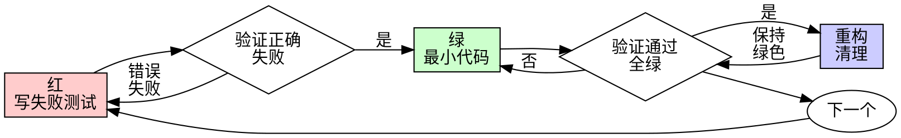

# 测试驱动开发（TDD）

## 概述

先写测试。看它失败。写最小代码让它通过。

**核心原则：** 如果你没看到测试失败，你就不知道它是否测对了东西。

**违反规则的字面意思就是违反规则的精神。**

## 何时使用

**总是：**
- 新功能
- Bug 修复
- 重构
- 行为变更

**例外（问你的搭档）：**
- 一次性原型
- 生成的代码
- 配置文件

想着"就这一次跳过 TDD"？停下。那是在找借口。

## 铁律

```
没有先写失败测试，不许写生产代码
```

先写了代码再写测试？删掉它。重新开始。

**没有例外：**
- 别留着当"参考"
- 别"改编"它来写测试
- 别看它
- 删除就是删除

从测试重新实现。句号。

## 红-绿-重构



### 红 - 写失败测试

写一个最小测试显示应该发生什么。

<Good>
```typescript
test('失败操作重试 3 次', async () => {
  let attempts = 0;
  const operation = () => {
    attempts++;
    if (attempts < 3) throw new Error('fail');
    return 'success';
  };

  const result = await retryOperation(operation);

  expect(result).toBe('success');
  expect(attempts).toBe(3);
});
```
清晰的名字，测试真实行为，只测一件事
</Good>

<Bad>
```typescript
test('重试有效', async () => {
  const mock = jest.fn()
    .mockRejectedValueOnce(new Error())
    .mockRejectedValueOnce(new Error())
    .mockResolvedValueOnce('success');
  await retryOperation(mock);
  expect(mock).toHaveBeenCalledTimes(3);
});
```
模糊的名字，测试 mock 而不是代码
</Bad>

**要求：**
- 一个行为
- 清晰的名字
- 真实代码（除非不可避免才用 mock）

### 验证红 - 看它失败

**强制。永远不跳过。**

```bash
npm test path/to/test.test.ts
```

确认：
- 测试失败（不是报错）
- 失败信息符合预期
- 因为功能缺失而失败（不是拼写错误）

**测试通过了？** 你在测试已有行为。修改测试。

**测试报错了？** 修复错误，重新运行直到它正确失败。

### 绿 - 最小代码

写最简单的代码让测试通过。

<Good>
```typescript
async function retryOperation<T>(fn: () => Promise<T>): Promise<T> {
  for (let i = 0; i < 3; i++) {
    try {
      return await fn();
    } catch (e) {
      if (i === 2) throw e;
    }
  }
  throw new Error('unreachable');
}
```
刚好够通过
</Good>

<Bad>
```typescript
async function retryOperation<T>(
  fn: () => Promise<T>,
  options?: {
    maxRetries?: number;
    backoff?: 'linear' | 'exponential';
    onRetry?: (attempt: number) => void;
  }
): Promise<T> {
  // YAGNI（你不会需要它）
}
```
过度设计
</Bad>

别添加功能，重构其他代码，或在测试之外"改进"。

### 验证绿 - 看它通过

**强制。**

```bash
npm test path/to/test.test.ts
```

确认：
- 测试通过
- 其他测试仍然通过
- 输出干净（没有错误、警告）

**测试失败？** 修改代码，不是测试。

**其他测试失败？** 现在修。

### 重构 - 清理

只在绿之后：
- 消除重复
- 改进命名
- 提取辅助函数

保持测试绿色。别添加行为。

### 重复

为下一个功能写下一个失败测试。

## 好的测试

| 质量 | 好 | 坏 |
|------|----|----|
| **最小** | 一件事。名字里有"和"？拆开。 | `test('验证邮箱和域名和空白')` |
| **清晰** | 名字描述行为 | `test('test1')` |
| **显示意图** | 展示期望的 API | 模糊代码应该做什么 |

## 为什么顺序重要

**"我之后写测试来验证它有效"**

之后写的测试立即通过。立即通过什么都不证明：
- 可能测错东西
- 可能测实现而不是行为
- 可能遗漏你忘记的边界情况
- 你从没看到它抓住 bug

先测试强迫你看到测试失败，证明它确实测试了什么。

**"我已经手动测试了所有边界情况"**

手动测试是临时的。你以为你测试了所有但：
- 没有记录你测了什么
- 代码变了不能重新运行
- 压力下容易忘记情况
- "我试的时候能用" ≠ 全面

自动化测试是系统的。每次运行都一样。

**"删除 X 小时的工作是浪费"**

沉没成本谬误。时间已经过去了。你现在的选择：
- 删除用 TDD 重写（多 X 小时，高信心）
- 保留之后加测试（30 分钟，低信心，可能有 bug）

"浪费"是保留你不能信任的代码。没有真正测试的工作代码是技术债务。

**"TDD 是教条的，务实意味着适应"**

TDD 就是务实的：
- 提交前发现 bug（比之后调试更快）
- 防止回归（测试立即抓住破坏）
- 记录行为（测试显示如何使用代码）
- 启用重构（自由改变，测试抓住破坏）

"务实"的捷径 = 在生产中调试 = 更慢。

**"之后测试达到同样目标——是精神不是仪式"**

不。之后测试回答"这做了什么？"先测试回答"这应该做什么？"

之后测试被你的实现偏见。你测试你构建的，不是需要的。你验证记得的边界情况，不是发现的。

先测试强迫在实现前发现边界情况。之后测试验证你记得所有（你没有）。

30 分钟的之后测试 ≠ TDD。你得到覆盖率，失去测试有效的证明。

## 常见借口

| 借口 | 现实 |
|------|------|
| "太简单不用测" | 简单代码会坏。测试只要 30 秒。 |
| "我之后测试" | 立即通过的测试什么都不证明。 |
| "之后测试达到同样目标" | 之后测试 = "这做了什么？"先测试 = "这应该做什么？" |
| "已经手动测试了" | 临时 ≠ 系统。没记录，不能重新运行。 |
| "删除 X 小时是浪费" | 沉没成本谬误。保留未验证代码是技术债务。 |
| "留着参考，先写测试" | 你会改编它。那是之后测试。删除就是删除。 |
| "需要先探索" | 可以。扔掉探索，从 TDD 开始。 |
| "测试难写 = 设计不清" | 听测试的。难测试 = 难使用。 |
| "TDD 会拖慢我" | TDD 比调试快。务实 = 先测试。 |
| "手动测试更快" | 手动不证明边界情况。每次改动都要重新测试。 |
| "现有代码没测试" | 你在改进它。为现有代码加测试。 |

## 红旗 - 停下重新开始

- 测试前写代码
- 实现后写测试
- 测试立即通过
- 不能解释为什么测试失败
- "之后"加测试
- 找借口"就这一次"
- "我已经手动测试了"
- "之后测试达到同样目的"
- "是精神不是仪式"
- "留着参考"或"改编现有代码"
- "已经花了 X 小时，删除是浪费"
- "TDD 是教条的，我是务实的"
- "这个不一样因为..."

**所有这些意味着：删除代码。从 TDD 重新开始。**

## 示例：Bug 修复

**Bug：** 接受空邮箱

**红**
```typescript
test('拒绝空邮箱', async () => {
  const result = await submitForm({ email: '' });
  expect(result.error).toBe('邮箱必填');
});
```

**验证红**
```bash
$ npm test
FAIL: expected '邮箱必填', got undefined
```

**绿**
```typescript
function submitForm(data: FormData) {
  if (!data.email?.trim()) {
    return { error: '邮箱必填' };
  }
  // ...
}
```

**验证绿**
```bash
$ npm test
PASS
```

**重构**
如果需要，为多个字段提取验证。

## 验证清单

标记工作完成前：

- [ ] 每个新函数/方法都有测试
- [ ] 实现前看到每个测试失败
- [ ] 每个测试因预期原因失败（功能缺失，不是拼写错误）
- [ ] 为每个测试写最小代码让它通过
- [ ] 所有测试通过
- [ ] 输出干净（没有错误、警告）
- [ ] 测试使用真实代码（只在不可避免时用 mock）
- [ ] 覆盖边界情况和错误

不能勾选所有？你跳过了 TDD。重新开始。

## 卡住时

| 问题 | 解决方案 |
|------|----------|
| 不知道怎么测 | 写期望的 API。先写断言。问搭档。 |
| 测试太复杂 | 设计太复杂。简化接口。 |
| 必须 mock 所有东西 | 代码耦合太紧。使用依赖注入。 |
| 测试设置太大 | 提取辅助函数。还复杂？简化设计。 |

## 调试集成

发现 bug？写失败测试复现它。遵循 TDD 循环。测试证明修复并防止回归。

永远不要没有测试就修 bug。

## 测试反模式

添加 mock 或测试工具时，阅读 @testing-anti-patterns.md 避免常见陷阱：
- 测试 mock 行为而不是真实行为
- 给生产类添加仅测试用的方法
- 不理解依赖就 mock

## 最终规则

```
生产代码 → 测试存在且先失败过
否则 → 不是 TDD
```

没有搭档的允许不能例外。
