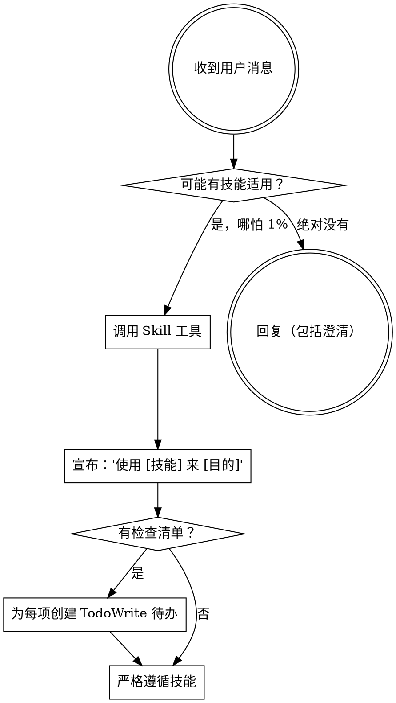

<EXTREMELY-IMPORTANT>
如果你认为有哪怕 1% 的可能某个技能适用于你正在做的事，你绝对必须调用该技能。

如果一个技能适用于你的任务，你没有选择。你必须使用它。

这不可商量。这不是可选的。你不能找借口绕过它。
</EXTREMELY-IMPORTANT>

## 如何访问技能

**在 Claude Code 中：** 使用 `Skill` 工具。当你调用一个技能时，它的内容会被加载并呈现给你——直接按照它做。永远不要用 Read 工具读取技能文件。

**在其他环境中：** 查看你的平台文档了解如何加载技能。

# 使用技能

## 规则

**在任何回复或行动之前，先调用相关或被请求的技能。** 哪怕只有 1% 的可能某个技能适用，你也应该调用它来检查。如果调用后发现技能不适合当前情况，你不需要使用它。

## 红旗

这些想法意味着停下——你在找借口：

| 想法 | 现实 |
|------|------|
| "这只是个简单问题" | 问题也是任务。检查技能。 |
| "我需要先了解更多上下文" | 技能检查在澄清问题之前。 |
| "让我先探索一下代码库" | 技能告诉你如何探索。先检查。 |
| "我可以快速查一下 git/文件" | 文件缺少对话上下文。检查技能。 |
| "让我先收集信息" | 技能告诉你如何收集信息。 |
| "这不需要正式的技能" | 如果技能存在，就用它。 |
| "我记得这个技能" | 技能会演进。读当前版本。 |
| "这不算任务" | 行动 = 任务。检查技能。 |
| "技能太重了" | 简单的事会变复杂。用它。 |
| "我先做这一件事" | 做任何事之前先检查。 |
| "感觉很有效率" | 没纪律的行动浪费时间。技能防止这个。 |
| "我知道那是什么意思" | 知道概念 ≠ 使用技能。调用它。 |

## 技能优先级

当多个技能可能适用时，用这个顺序：

1. **先用流程技能**（头脑风暴、调试）- 这些决定如何处理任务
2. **再用实施技能**（前端设计、mcp-builder）- 这些指导执行

"让我们构建 X" → 先头脑风暴，然后实施技能。
"修这个 bug" → 先调试，然后领域特定技能。

## 技能类型

**刚性**（TDD、调试）：严格遵循。不要为了适应而放弃纪律。

**灵活**（模式）：根据上下文调整原则。

技能本身会告诉你它是哪种。

## 用户指令

指令说的是做什么，不是怎么做。"添加 X" 或 "修 Y" 不意味着跳过工作流。
