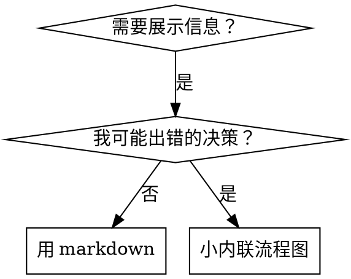

# 编写技能

## 概述

**编写技能就是将测试驱动开发应用于流程文档。**

**个人技能存在代理特定目录（Claude Code 用 `~/.claude/skills`，Codex 用 `~/.codex/skills`）**

你编写测试用例（用子代理的压力场景），看它们失败（基线行为），编写技能（文档），看测试通过（代理遵守），重构（堵漏洞）。

**核心原则：** 如果你没看到代理没有技能时失败，你就不知道技能是否教对了东西。

**必需背景：** 你必须理解 superpowers:test-driven-development 再使用此技能。那个技能定义了基础的红-绿-重构循环。此技能将 TDD 应用于文档。

**官方指南：** 关于 Anthropic 的官方技能编写最佳实践，见 anthropic-best-practices.md。该文档提供了补充本技能 TDD 聚焦方法的额外模式和指南。

## 什么是技能？

**技能**是经过验证的技术、模式或工具的参考指南。技能帮助未来的 Claude 实例找到并应用有效方法。

**技能是：** 可重用技术、模式、工具、参考指南

**技能不是：** 关于你如何解决某个问题的叙述

## TDD 到技能的映射

| TDD 概念 | 技能创建 |
|----------|----------|
| **测试用例** | 用子代理的压力场景 |
| **生产代码** | 技能文档（SKILL.md）|
| **测试失败（红）** | 代理没有技能时违反规则（基线）|
| **测试通过（绿）** | 代理有技能时遵守 |
| **重构** | 堵漏洞同时保持遵守 |
| **先写测试** | 写技能前运行基线场景 |
| **看它失败** | 记录代理使用的确切合理化 |
| **最小代码** | 编写技能解决那些特定违反 |
| **看它通过** | 验证代理现在遵守 |
| **重构循环** | 发现新合理化 → 堵上 → 重验证 |

整个技能创建流程遵循红-绿-重构。

## 何时创建技能

**创建当：**
- 技术对你不是直观显而易见的
- 你会跨项目再次引用这个
- 模式广泛应用（不是项目特定）
- 其他人会受益

**别创建对于：**
- 一次性解决方案
- 其他地方有充分文档的标准实践
- 项目特定约定（放在 CLAUDE.md）
- 机械约束（如果可以用正则/验证强制，自动化它——为判断调用保留文档）

## 技能类型

### 技术
带步骤的具体方法（基于条件的等待、根本原因追踪）

### 模式
思考问题的方式（用标志扁平化、测试不变量）

### 参考
API 文档、语法指南、工具文档（office 文档）

## 目录结构

```
skills/
  skill-name/
    SKILL.md              # 主参考（必需）
    supporting-file.*     # 只在需要时
```

**扁平命名空间** - 所有技能在一个可搜索命名空间

**分离文件对于：**
1. **重型参考**（100+ 行）- API 文档、全面语法
2. **可重用工具** - 脚本、工具、模板

**保持内联：**
- 原则和概念
- 代码模式（< 50 行）
- 所有其他

## SKILL.md 结构

**前置（YAML）：**
- 只支持两个字段：`name` 和 `description`
- 最多 1024 字符
- `name`：只用字母、数字、连字符（无括号、特殊字符）
- `description`：第三人称，只描述何时使用（不是它做什么）
  - 以 "Use when..." 开始聚焦触发条件
  - 包括具体症状、情况、上下文
  - **永远不要总结技能的流程或工作流**（见 CSO 章节了解原因）
  - 如果可能保持在 500 字符以下

```markdown
---
name: Skill-Name-With-Hyphens
description: Use when [具体触发条件和症状]
---

# 技能名

## 概述
这是什么？1-2 句核心原则。

## 何时使用
[小内联流程图如果决策不明显]

带症状和用例的要点列表
何时不用

## 核心模式（对技术/模式）
前后代码对比

## 快速参考
扫描常见操作的表格或要点

## 实施
简单模式的内联代码
重型参考或可重用工具的文件链接

## 常见错误
什么出错 + 修复

## 真实世界影响（可选）
具体结果
```

## Claude 搜索优化（CSO）

**对发现关键：** 未来 Claude 需要找到你的技能

### 1. 丰富描述字段

**目的：** Claude 读描述决定为给定任务加载哪些技能。让它回答："我现在应该读这技能吗？"

**格式：** 以 "Use when..." 开始聚焦触发条件

**关键：描述 = 何时使用，不是技能做什么**

描述应该只描述触发条件。不要在描述中总结技能的流程或工作流。

**为什么重要：** 测试表明当描述总结技能工作流时，Claude 可能遵循描述而不是读完整技能内容。一个说"任务间代码审查"的描述导致 Claude 做了一次审查，即使技能流程图清楚显示两次审查（规格合规然后代码质量）。

当描述改为只是"在当前会话中执行有独立任务的实施计划时使用"（无工作流总结），Claude 正确读流程图并遵循两阶段审查流程。

**陷阱：** 总结工作流的描述创建了 Claude 会走的捷径。技能主体变成 Claude 跳过的文档。

```yaml
# ❌ 坏：总结工作流 - Claude 可能遵循这个而不是读技能
description: Use when executing plans - dispatches subagent per task with code review between tasks

# ❌ 坏：太多流程细节
description: Use for TDD - write test first, watch it fail, write minimal code, refactor

# ✅ 好：只触发条件，无工作流总结
description: Use when executing implementation plans with independent tasks in the current session

# ✅ 好：只触发条件
description: Use when implementing any feature or bugfix, before writing implementation code
```

**内容：**
- 使用具体触发器、症状、表明此技能适用的情况
- 描述*问题*（竞态条件、不一致行为）不是*特定语言症状*（setTimeout、sleep）
- 保持触发器技术无关，除非技能本身特定技术
- 如果技能特定技术，在触发器中明确
- 用第三人称写（注入系统提示）
- **永远不要总结技能的流程或工作流**

```yaml
# ❌ 坏：太抽象、模糊、不包括何时用
description: For async testing

# ❌ 坏：第一人称
description: I can help you with async tests when they're flaky

# ❌ 坏：提到技术但技能不特定它
description: Use when tests use setTimeout/sleep and are flaky

# ✅ 好：以 "Use when" 开始，描述问题，无工作流
description: Use when tests have race conditions, timing dependencies, or pass/fail inconsistently

# ✅ 好：特定技术技能带明确触发器
description: Use when using React Router and handling authentication redirects
```

### 2. 关键词覆盖

使用 Claude 会搜索的词：
- 错误信息："Hook timed out"、"ENOTEMPTY"、"race condition"
- 症状："flaky"、"hanging"、"zombie"、"pollution"
- 同义词："timeout/hang/freeze"、"cleanup/teardown/afterEach"
- 工具：实际命令、库名、文件类型

### 3. 描述性命名

**使用主动语态、动词优先：**
- ✅ `creating-skills` 不是 `skill-creation`
- ✅ `condition-based-waiting` 不是 `async-test-helpers`

### 4. Token 效率（关键）

**问题：** getting-started 和频繁引用的技能加载到每个对话。每个 token 都重要。

**目标字数：**
- getting-started 工作流：< 150 字每个
- 频繁加载技能：< 200 字总计
- 其他技能：< 500 字（仍要简洁）

**技术：**

**移细节到工具帮助：**
```bash
# ❌ 坏：在 SKILL.md 记录所有标志
search-conversations supports --text, --both, --after DATE, --before DATE, --limit N

# ✅ 好：引用 --help
search-conversations supports multiple modes and filters. Run --help for details.
```

**使用交叉引用：**
```markdown
# ❌ 坏：重复工作流细节
When searching, dispatch subagent with template...
[20 行重复指令]

# ✅ 好：引用其他技能
Always use subagents (50-100x context savings). REQUIRED: Use [other-skill-name] for workflow.
```

**压缩示例：**
```markdown
# ❌ 坏：冗长示例（42 字）
your human partner: "How did we handle authentication errors in React Router before?"
You: I'll search past conversations for React Router authentication patterns.
[Dispatch subagent with search query: "React Router authentication error handling 401"]

# ✅ 好：最小示例（20 字）
Partner: "How did we handle auth errors in React Router?"
You: Searching...
[Dispatch subagent → synthesis]
```

**消除冗余：**
- 别重复交叉引用技能中的
- 别解释从命令显而易见的
- 别包含同一模式的多个示例

**验证：**
```bash
wc -w skills/path/SKILL.md
# getting-started 工作流：目标 < 150 每个
# 其他频繁加载：目标 < 200 总计
```

**按你做什么或核心洞察命名：**
- ✅ `condition-based-waiting` > `async-test-helpers`
- ✅ `using-skills` 不是 `skill-usage`
- ✅ `flatten-with-flags` > `data-structure-refactoring`
- ✅ `root-cause-tracing` > `debugging-techniques`

**动名词（-ing）对流程效果好：**
- `creating-skills`、`testing-skills`、`debugging-with-logs`
- 主动，描述你在做的行动

### 4. 交叉引用其他技能

**当编写引用其他技能的文档时：**

只用技能名，带明确需求标记：
- ✅ 好：`**必需子技能：** 使用 superpowers:test-driven-development`
- ✅ 好：`**必需背景：** 你必须理解 superpowers:systematic-debugging`
- ❌ 坏：`见 skills/testing/test-driven-development`（不清楚是否必需）
- ❌ 坏：`@skills/testing/test-driven-development/SKILL.md`（强制加载，烧 context）

**为什么不用 @ 链接：** `@` 语法立即强制加载文件，在你需要前消耗 200k+ context。

## 流程图使用



**只对以下使用流程图：**
- 不明显的决策点
- 你可能过早停止的流程循环
- "何时用 A vs B" 决策

**永远不对以下使用流程图：**
- 参考材料 → 表格、列表
- 代码示例 → Markdown 块
- 线性指令 → 编号列表
- 没有语义意义的标签（step1、helper2）

见 @graphviz-conventions.dot 了解 graphviz 样式规则。

**为搭档可视化：** 使用此目录中的 `render-graphs.js` 将技能流程图渲染为 SVG：
```bash
./render-graphs.js ../some-skill           # 每个图单独
./render-graphs.js ../some-skill --combine # 所有图在一个 SVG
```

## 代码示例

**一个优秀示例胜过许多平庸的**

选最相关语言：
- 测试技术 → TypeScript/JavaScript
- 系统调试 → Shell/Python
- 数据处理 → Python

**好示例：**
- 完整可运行
- 好注释解释为什么
- 来自真实场景
- 清楚展示模式
- 准备好改编（不是通用模板）

**别：**
- 用 5+ 语言实施
- 创建填空模板
- 写人造示例

你擅长移植 - 一个好示例足够。

## 文件组织

### 自包含技能
```
defense-in-depth/
  SKILL.md    # 所有内联
```
何时：所有内容适合，不需重型参考

### 带可重用工具的技能
```
condition-based-waiting/
  SKILL.md    # 概述 + 模式
  example.ts  # 工作辅助函数可改编
```
何时：工具是可重用代码，不只是叙述

### 带重型参考的技能
```
pptx/
  SKILL.md       # 概述 + 工作流
  pptxgenjs.md   # 600 行 API 参考
  ooxml.md       # 500 行 XML 结构
  scripts/       # 可执行工具
```
何时：参考材料对内联太大

## 铁律（与 TDD 相同）

```
没有先失败测试就没有技能
```

这适用于新技能和现有技能编辑。

写测试前写技能？删掉它。重新开始。
编辑技能不测试？同样违反。

**没有例外：**
- 不对"简单添加"
- 不对"只加一节"
- 不对"文档更新"
- 别保留未测试改动作"参考"
- 别在运行测试时"改编"
- 删除就是删除

**必需背景：** superpowers:test-driven-development 技能解释为什么这重要。同样原则应用于文档。

## 测试所有技能类型

不同技能类型需要不同测试方法：

### 纪律强制技能（规则/需求）

**示例：** TDD、验证后完成、设计后编码

**测试用：**
- 学术问题：它们理解规则吗？
- 压力场景：压力下遵守吗？
- 多重压力结合：时间 + 沉没成本 + 疲惫
- 识别合理化并添加明确反击

**成功标准：** 代理在最大压力下遵循规则

### 技术技能（操作指南）

**示例：** 基于条件的等待、根本原因追踪、防御性编程

**测试用：**
- 应用场景：它们能正确应用技术吗？
- 变化场景：它们处理边缘情况吗？
- 缺失信息测试：指令有缺口吗？

**成功标准：** 代理成功将技术应用于新场景

### 模式技能（心智模型）

**示例：** 降低复杂性、信息隐藏概念

**测试用：**
- 识别场景：它们识别模式何时适用吗？
- 应用场景：它们能使用心智模型吗？
- 反例：它们知道何时不应用吗？

**成功标准：** 代理正确识别何时/如何应用模式

### 参考技能（文档/API）

**示例：** API 文档、命令参考、库指南

**测试用：**
- 检索场景：它们能找到正确信息吗？
- 应用场景：它们能正确使用找到的吗？
- 缺口测试：常见用例覆盖了吗？

**成功标准：** 代理找到并正确应用参考信息

## 跳过测试的常见合理化

| 借口 | 现实 |
|------|------|
| "技能明显清楚" | 对你清楚 ≠ 对其他代理清楚。测试它。 |
| "只是参考" | 参考可能有缺口、不清楚部分。测试检索。 |
| "测试是过度" | 未测试技能有问题。总是。15 分钟测试省数小时。 |
| "问题浮现时测试" | 问题 = 代理无法使用技能。部署前测试。 |
| "测试太繁琐" | 测试比调试生产中坏技能少繁琐。 |
| "我确信它好" | 过度自信保证问题。无论如何测试。 |
| "学术审查足够" | 阅读 ≠ 使用。测试应用场景。 |
| "没时间测试" | 部署未测试技能后修浪费更多时间。 |

**所有这些意味着：部署前测试。没有例外。**

## 防弹技能抵抗合理化

强制纪律（如 TDD）的技能需要抵抗合理化。代理聪明，压力下会找漏洞。

**心理学注释：** 理解为什么说服技术有效帮你系统地应用它们。见 persuasion-principles.md 了解权威、承诺、稀缺、社会证明和团结原则的研究基础（Cialdini, 2021; Meincke et al., 2025）。

### 明确堵住每个漏洞

别只陈述规则 - 禁止具体变通：

<Bad>
```markdown
测试前写代码？删掉它。
```
</Bad>

<Good>
```markdown
测试前写代码？删掉它。重新开始。

**没有例外：**
- 别保留作"参考"
- 别写测试时"改编"它
- 别看它
- 删除就是删除
```
</Good>

### 解决"精神 vs 字面"论证

早早加基础原则：

```markdown
**违反规则字面就是违反规则精神。**
```

这切断整类"我遵循精神"合理化。

### 构建合理化表

从基线测试捕获合理化（见下面测试章节）。代理的每个借口都进表：

```markdown
| 借口 | 现实 |
|------|------|
| "太简单不测" | 简单代码会坏。测试只要 30 秒。 |
| "之后测" | 立即通过的测试什么都不证明。 |
| "之后测试达到同样目标" | 之后测试 = "这做了什么？" 先测试 = "这应该做什么？" |
```

### 创建红旗列表

让代理在合理化时容易自查：

```markdown
## 红旗 - 停下重新开始

- 测试前代码
- "我已经手动测试了"
- "之后测试达到同样目的"
- "是精神不是仪式"
- "这不一样因为..."

**所有这些意味着：删代码。从 TDD 重新开始。**
```

### 更新 CSO 对违反症状

添加到描述：你将要违反规则时的症状：

```yaml
description: use when implementing any feature or bugfix, before writing implementation code
```

## 技能的红-绿-重构

遵循 TDD 循环：

### 红：写失败测试（基线）

用子代理运行压力场景没有技能。记录确切行为：
- 它们做了什么选择？
- 它们使用了什么合理化（逐字）？
- 哪些压力触发了违反？

这是"看测试失败" - 你必须看代理写技能前自然做什么。

### 绿：写最小技能

写技能解决那些特定合理化。别为假设情况加额外内容。

用技能运行同样场景。代理现在应该遵守。

### 重构：堵漏洞

代理找到新合理化？加明确反击。重测直到防弹。

**测试方法：** 见 @testing-skills-with-subagents.md 完整测试方法：
- 如何写压力场景
- 压力类型（时间、沉没成本、权威、疲惫）
- 系统地堵洞
- 元测试技术

## 反模式

### ❌ 叙述示例
"在 2025-10-03 会话中，我们发现空 projectDir 导致..."
**为什么坏：** 太具体，不可重用

### ❌ 多语言稀释
example-js.js, example-py.py, example-go.go
**为什么坏：** 质量平庸，维护负担

### ❌ 流程图中的代码
```dot
step1 [label="import fs"];
step2 [label="read file"];
```
**为什么坏：** 无法复制粘贴，难读

### ❌ 通用标签
helper1, helper2, step3, pattern4
**为什么坏：** 标签应该有语义意义

## 停：转到下个技能前

**写任何技能后，你必须停下并完成部署流程。**

**别：**
- 批量创建多个技能不测每个
- 在当前验证前转到下个技能
- 因"批量更高效"跳过测试

**下面部署检查表对每个技能是强制的。**

部署未测试技能 = 部署未测试代码。这是质量标准违反。

## 技能创建检查表（TDD 改编）

**重要：使用 TodoWrite 为下面每个检查表项创建待办。**

**红阶段 - 写失败测试：**
- [ ] 创建压力场景（对纪律技能 3+ 组合压力）
- [ ] 运行场景没有技能 - 逐字记录基线行为
- [ ] 识别合理化/失败的模式

**绿阶段 - 写最小技能：**
- [ ] 名字只用字母、数字、连字符（无括号/特殊字符）
- [ ] YAML 前置只有 name 和 description（最多 1024 字符）
- [ ] 描述以 "Use when..." 开始并包括具体触发器/症状
- [ ] 描述用第三人称写
- [ ] 全篇关键词用于搜索（错误、症状、工具）
- [ ] 清晰概述带核心原则
- [ ] 解决红中识别的具体基线失败
- [ ] 代码内联或链接到单独文件
- [ ] 一个优秀示例（不是多语言）
- [ ] 运行场景带技能 - 验证代理现在遵守

**重构阶段 - 堵漏洞：**
- [ ] 从测试识别新合理化
- [ ] 添加明确反击（如果纪律技能）
- [ ] 从所有测试迭代构建合理化表
- [ ] 创建红旗列表
- [ ] 重测直到防弹

**质量检查：**
- [ ] 小流程图只在决策不明显时
- [ ] 快速参考表
- [ ] 常见错误章节
- [ ] 无叙述讲故事
- [ ] 支持文件只对工具或重型参考

**部署：**
- [ ] 提交技能到 git 并推送到你的 fork（如果配置）
- [ ] 考虑通过 PR 回贡献（如果广泛有用）

## 发现工作流

未来 Claude 如何找到你的技能：

1. **遇到问题**（"测试不稳定"）
3. **找到技能**（描述匹配）
4. **扫描概述**（这相关吗？）
5. **读模式**（快速参考表）
6. **加载示例**（只在实施时）

**为此流程优化** - 把可搜索术语放早并频繁。

## 底线

**创建技能就是流程文档的 TDD。**

同样铁律：没有先失败测试就没有技能。
同样循环：红（基线）→ 绿（写技能）→ 重构（堵漏洞）。
同样收益：更好质量、更少惊喜、防弹结果。

如果你对代码遵循 TDD，对技能也遵循它。这是应用于文档的同一纪律。
